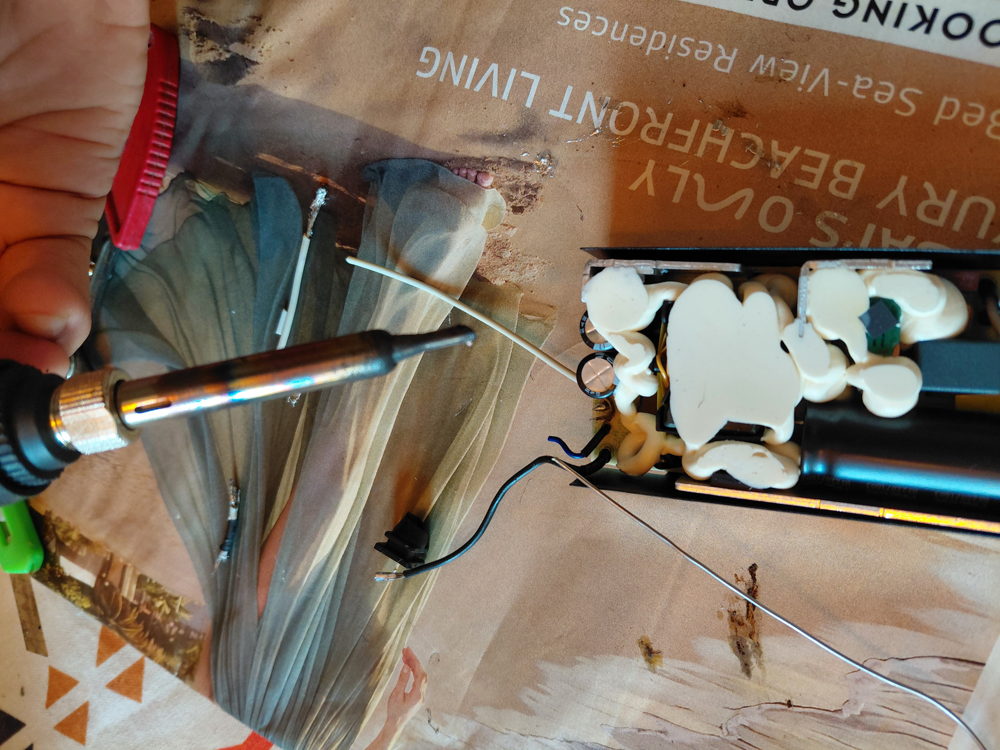
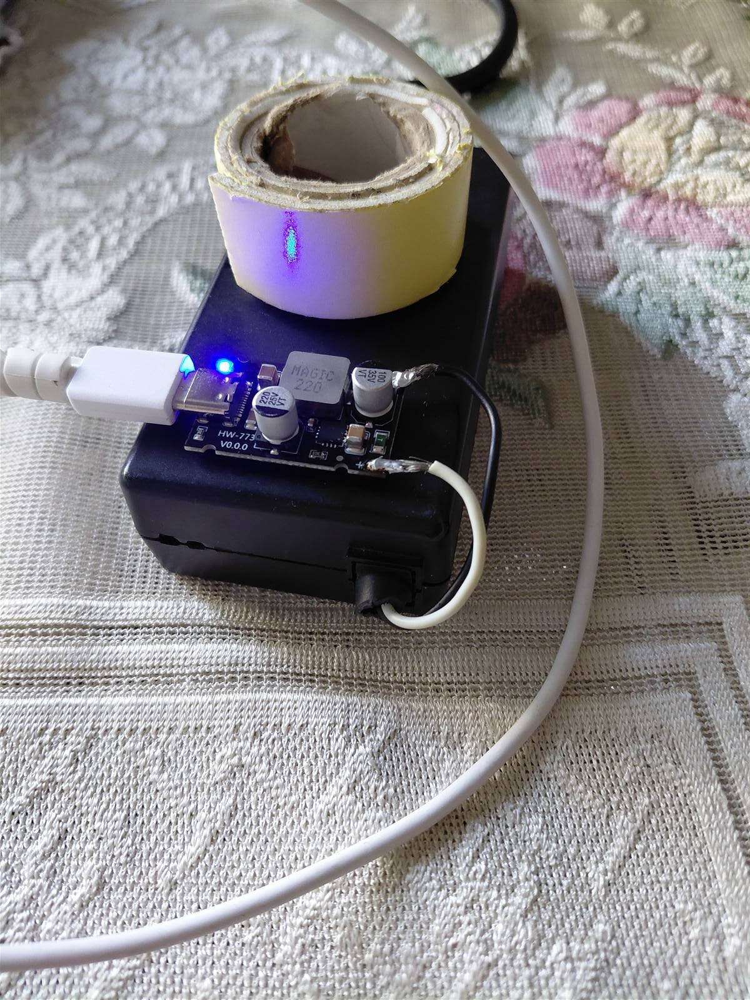

# 65W Type-C Charger from E-Waste (HP Adapter + PD65 Module)

This project converts an old HP 65W laptop adapter into a practical Type-C fast charger using a PD65 buck/trigger module.

Goal:
- Reuse quality e-waste hardware
- Build a reliable fast charger with minimal cost
- Document the build process clearly with visuals

## What I Used

- Old HP 65W laptop charger (19.5V, 3.33A)
- PD65/HW-773 Type-C fast charging module
- 5A E-marker Type-C cable
- Zip ties
- Foam/double tape spacers
- Small plastic box for protection

## Safety First

- Unplug mains power before opening or soldering anything.
- Verify polarity with a multimeter before connecting the PD module.
- Insulate all exposed contacts.
- Do not enclose the module airtight; it needs airflow.

## Building Process (Step-by-Step with Images)

### 1) Open the donor charger and inspect

Check that the HP charger output is stable and the cable condition is good.

### 2) Confirm polarity and input wiring to PD65 module

Identify positive/negative leads and wire them correctly to module input pads.

### 3) Solder the input leads to the module

Keep solder joints short, clean, and strong to reduce resistance and heat.

### 4) Add thermal gap using double-tape corner pads

Do not place tape directly under hot components. Use small corner pads to create an air gap.

### 5) Secure module mechanically with zip ties

Use 3 zip ties for a friction-lock mount so the module does not wiggle when cable force is applied.

### 6) Add protective outer casing

Use a ventilated plastic cover to protect from dust/finger contact while allowing heat to escape.

## Troubleshooting Notes

- Standard fast charging is stable and efficient with this setup.
- Samsung "Super Fast Charging 2.0" may not trigger on some PD modules due to firmware-level PPS limitations in the module controller, not necessarily because of the source adapter.
- Testing with a higher-power source can help isolate whether the limit is source current, cable, or module firmware.

## Bill of Materials (Approx)

| Component | Role | Cost |
| :--- | :--- | :--- |
| HP 65W adapter (salvaged) | Main DC source | 0 |
| PD65/HW-773 module | Type-C PD/QC negotiation + buck stage | ~150 INR |
| 5A E-marker Type-C cable | Stable high-current USB-C path | ~300 INR |
| Zip ties + tape + casing | Mechanical and insulation support | ~40 to 60 INR |

Total: around 490 to 510 INR depending on parts available.

## Result

The build gives a robust, low-cost Type-C charger by reusing an old HP power brick and adding a PD65 smart output stage.

If you are viewing this repo for replication, follow the images above in order and test each stage before moving to the next one.
